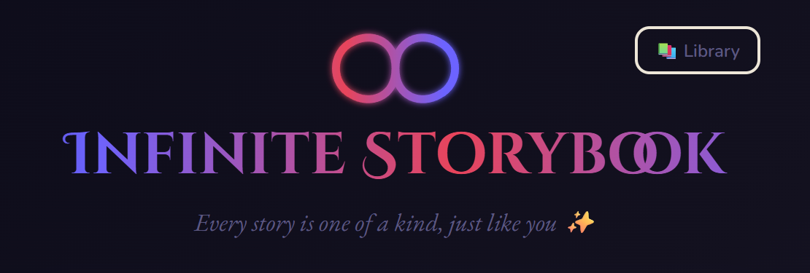
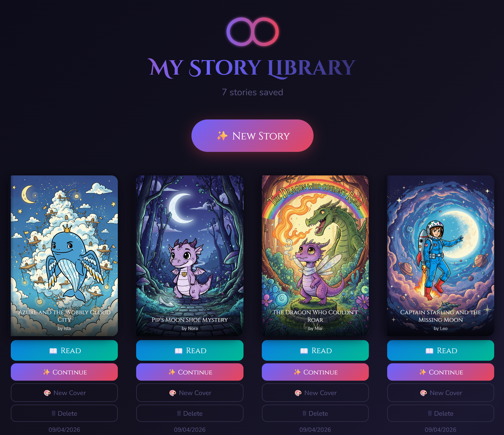
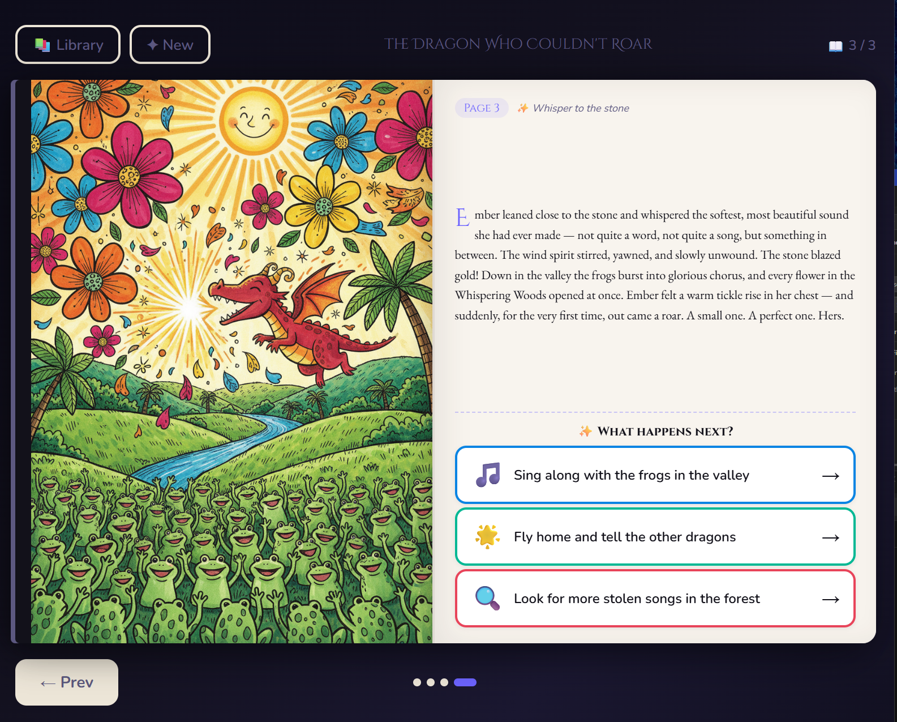
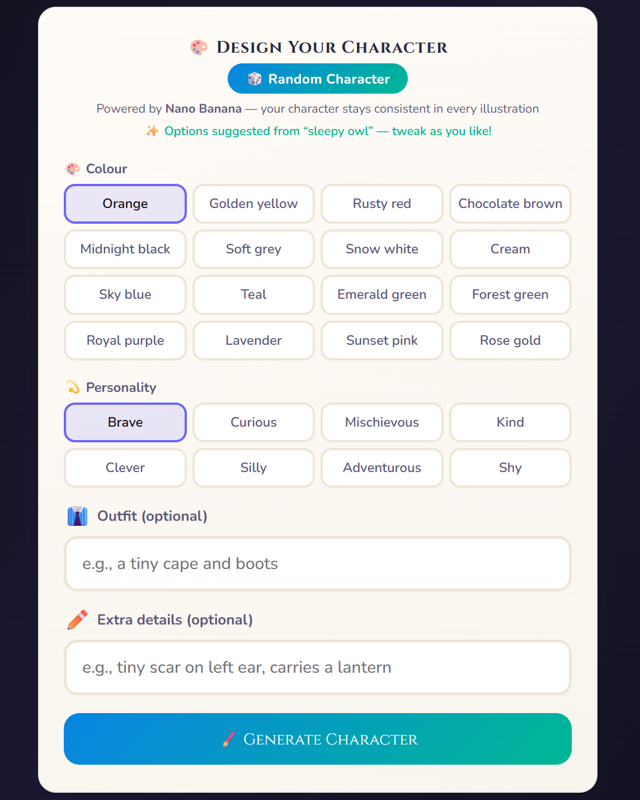
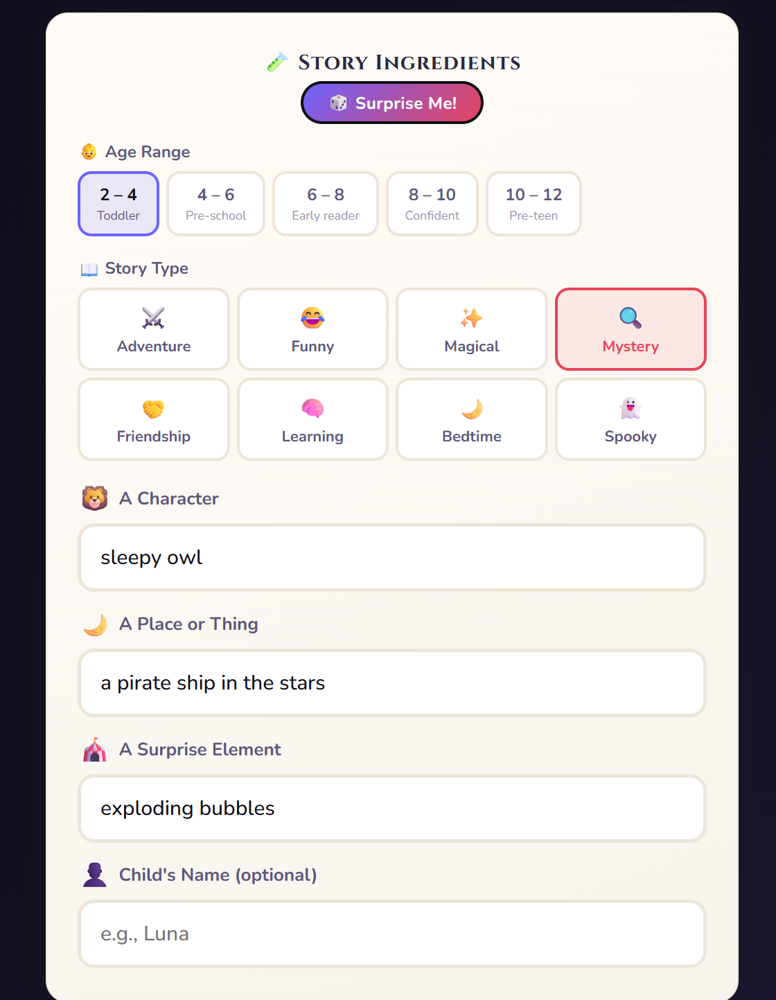

<p align="center">
  
</p>

<p align="center">
  <strong>An AI-powered storybook that writes itself — starring your child's imagination.</strong><br/>
  Every story is one of a kind, just like you. ✨
</p>

<p align="center">
  
  
  
</p>

---

## What is Infinite Storybook?

Infinite Storybook turns anyone's imagination into a beautifully illustrated picture book — in seconds. For younger children, it's a shared adventure: parents and kids set the scene together, then little ones make the choices that shape the story. For older children, hand them the controls — they can build the character, mix the ingredients, and generate everything from scratch entirely on their own. And for the grown-ups? It turns out a good story has no age limit.

---

## Screenshots

<table>
<tr>
<td width="50%" valign="top">

### 📚 Your Story Library

Browse, re-read, and continue every story your child has created. AI-generated covers are saved permanently to your library.



</td>
<td width="50%" valign="top">

### 📖 The Reading Experience

A full two-page spread — vivid illustration on the left, beautifully typeset story text on the right. Three choices drive the story forward at every turn.



</td>
</tr>
<tr>
<td width="50%" valign="top">

### 🎨 Design Your Character

Pick a colour, personality, outfit, and extra details. AI generates a unique character portrait that stays visually consistent across every page.



</td>
<td width="50%" valign="top">

### ✨ Story Ingredients

Choose an age range, a genre, and give the story three ingredients — a character, a place, and a surprise. Hit **Surprise Me!** to let the AI pick.



</td>
</tr>
</table>

---

## How It Works

| Step | What happens |
|------|-------------|
| **1. Mix the ingredients** | Choose age range, genre (Adventure, Funny, Mystery, Magical…), and give the story three prompts |
| **2. Design the hero** | Pick colour, personality and outfit — or hit Surprise Me! for a random character |
| **3. Generate** | AI writes the opening page and paints the first illustration |
| **4. Make choices** | Your child picks from three branches at the end of every page, shaping what happens next |
| **5. Save to your library** | Stories are saved permanently and can be re-read or continued any time |

---

## Why Children Love It

### 🧠 Develops Critical Thinking
At the end of every page, children face three branching choices that change the story. No wrong answers — only consequences to explore. This teaches cause-and-effect reasoning in a completely safe, low-stakes environment.

### 🎨 Sparks Creative Imagination
Children provide the story ingredients. When they see their ideas become a full illustrated book, it sends a powerful message: *your imagination has real power*.

### 💬 Expands Vocabulary Naturally
Stories are calibrated to your child's exact age group — from toddler-simple (ages 2–4) to pre-teen sophisticated (ages 10–12). Vocabulary and sentence complexity scale with the reader.

### 🤝 Builds Empathy
The Friendship and Bedtime genres centre on kindness, teamwork, and understanding feelings — a proven way to develop emotional intelligence through narrative.

### 🌙 A Calming Bedtime Ritual
The Bedtime genre produces slow, dreamy, soothing stories perfectly paced for winding down. A consistent reading ritual before sleep creates lasting positive associations with books.

### 👪 Quality Parent–Child Time
Reading together is one of the highest-impact things a parent can do for a child's development. Infinite Storybook makes it interactive — discuss the choices together, predict what might happen, and share a story that is uniquely yours.

---

## Getting Started

You need a free Google Gemini API key — takes about 60 seconds to get one.

**1.** Go to [aistudio.google.com/apikey](https://aistudio.google.com/apikey) and create a free key

**2.** Clone and run:

```bash
npm install
npm run dev
```

**3.** Open [http://localhost:5173](http://localhost:5173), paste your key, and start your first story.

> The free Gemini tier is sufficient for dozens of stories per day.

---

## Privacy & Safety

| | |
|---|---|
| 🔒 **No account required** | No sign-up, no tracking, no data sent to any server |
| 🔑 **Your key stays local** | API key is stored only in your browser session, never on an external service |
| 👶 **Child-appropriate content** | The AI is instructed to produce age-appropriate, positive, safe stories at all times |
| 💾 **Offline-capable** | Stories and images are stored locally using IndexedDB — no cloud required |

---

## Project Structure

```
src/
├── App.jsx             # Root routing, global CSS, library helpers
├── SetupScreen.jsx     # Story setup: age, genre, character designer
├── StoryScreen.jsx     # The book: two-page spread, page-turn, choices
├── LibraryScreen.jsx   # Saved story bookshelf with cover generation
├── api.js              # Gemini API layer (story text + image generation)
├── imageStore.js       # IndexedDB wrapper for persistent image storage
├── sampleBooks.js      # Pre-seeded sample stories
├── components.jsx      # Shared UI components
└── constants.js        # Palette, fonts, genre/age options
```

---

## 🔮 Coming Soon

### 🔊 Audio Readalong
The story is narrated aloud with word-by-word highlighting — perfect for early readers building phonics and fluency, and for younger children following along before they can read independently.

### 📬 Print Your Book
Turn your story into a real printed book, delivered to your door. Every page — cover, illustrations, and text — professionally printed as a keepsake your child will treasure forever.

### 🎙️ Voice Character Creator
Let your child describe their character out loud. Speech-to-text turns their words into the character description, making setup feel like telling a story before the story even begins.

### 👨‍👩‍👧 Family Bookshelf
Share your library across devices — on a tablet at bedtime, a laptop at grandma's, or a phone on the way to school. Stories sync automatically so no page is ever lost.

### 🌍 Multilingual Stories
Generate stories in any language. Perfect for bilingual families or children learning a second language through immersive narrative.

### 🏆 Story Milestones & Badges
Children earn illustrated badges as they read — for their first choice, first completed story, exploring every genre, and more. A gentle reward system that builds a reading habit.

### 🧩 Story Remix
Take any saved story and remix it — swap the genre, change the ending, or put a new character into the same world. Every story becomes a creative starting point, not a final destination.

### 📅 Reading Streaks & Parent Dashboard
Track reading streaks, stories completed, vocabulary encountered, and genres explored. Celebrate your child's reading journey with milestone cards you can share or print.

---

## License

MIT — free to use, modify, and share.
